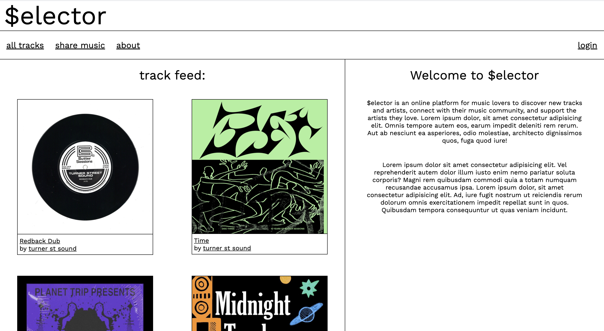
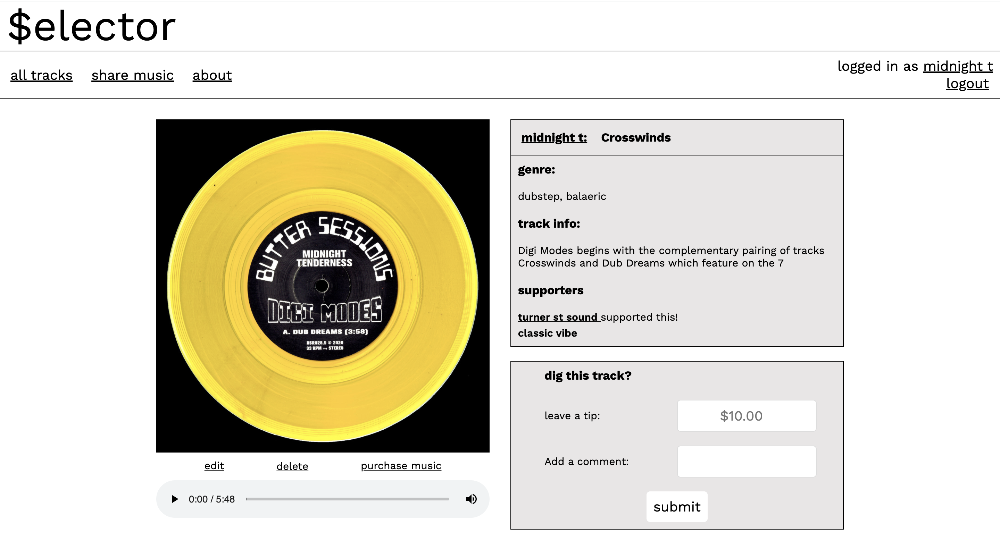
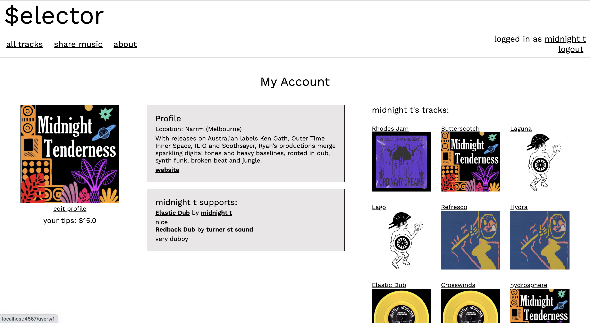
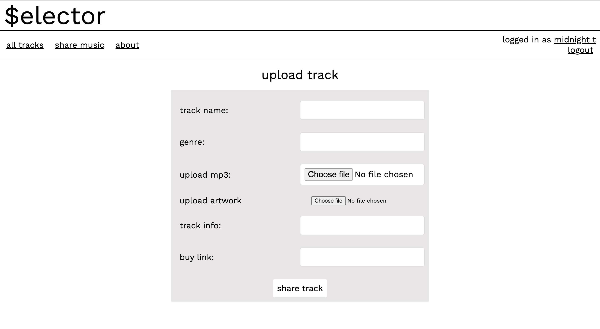

# $elector Music App

Use the live app here: https://selector-music.herokuapp.com/

$elector is an online platform for music lovers and makers to share their creations, discover new artists and music, and even drop a little tip to artists whose tunes they appreciate.

The app was loosely inspired by the idea of busking; casually hearing some new music and throwing a dollar or two in that instrument case layed out on the footpath, maybe buying a CD or just discovering a new artist.

## Functionality

Fresh music uploads appear on the feed in the index page.

Visitors to the site can listen to tracks, visit artist pages, leave tips on tracks and create their own accounts. 

Logging in allows customisation of the users account page information, uploading of tracks and leaving optional comments along with tips. Each users account page displays the artists and tracks they have supported with tips and their track uploads (if any).

## Technology used

- Vanilla html css and javascript for the client side
- Ruby + Sinatra for the server side
- PostgreSQL for the database
- Cloudinary API & SPK for file hosting
- BCrypt for password encryption 

## Feature wishlist

The following are features I would like to add or improve:

- A search function for artists and tracks
- Better integration with Cloudinary
    - Utilise the widget for easier uploading
    - Automatically convert audio files to mp3 on upload
    -  Crop images to squares on upload
- A custom player for the audio
- The ability for users to 'follow' other users

## Screenshots

